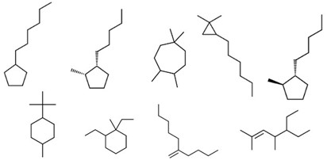

# Gaussian
Problem 1. Model the following reactions(Reactants, products, transition state and reaction pathway) and summarize the results
•	Tautomerism of Acetone
•	Diels-Alder reaction between ethylene and butadiene

Problem 2. Calculate and plot the relative energies for the following C11H22 isomers

 
Problem 3. Perform conformational analysis for the following dihedral angles of n-hexane(see figure 1). Choose appropriate step sizes and identify various points of interest(staggered, eclipsed etc).
•	Dihedral angle formed by the carbons 1,2,3,4
•	Dihedral angle formed by the carbons 3,4,5,6
•	2D scan of the above two dihedral angles
Problem 4. Calculate the vibrational spectrum of ethanol. Perform normal mode analysis and assign major peaks in the experimental spectrum(see figure 2) through comparisons.
1
Figure 1: n-hexane
 
Figure 2: IR spectrum of ethanol
Problem 5. Read the attached study on ”The intrinsic reaction coordinate”. Perform IRC scans for the reactions described in the paper and draw comparisions.
